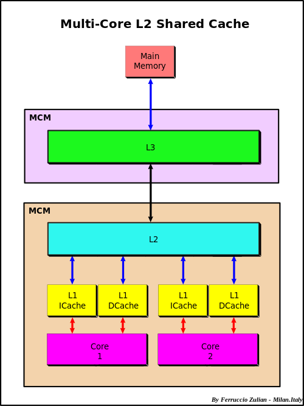

# Exercise: Cache Sizes

**Note: This exercise should be done on a Hawk compute node.** (Your laptop should only be a fallback option.)

In this exercise you will time a **vector multiplication** kernel (i.e. `c[i] = a[i] * b[i]`) and see how the observed performance is effected by the sizes of different cache levels (L1, L2, and L3).

The file `cache_sizes.jl` contains the hopefully straightforward instructions.

